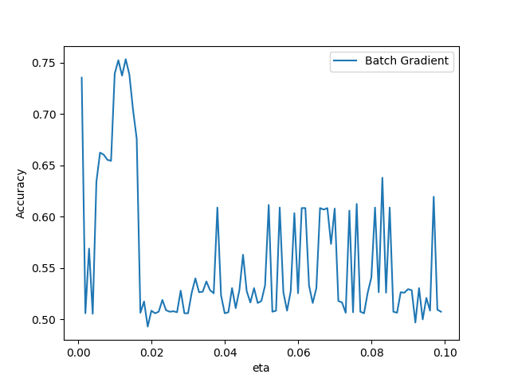
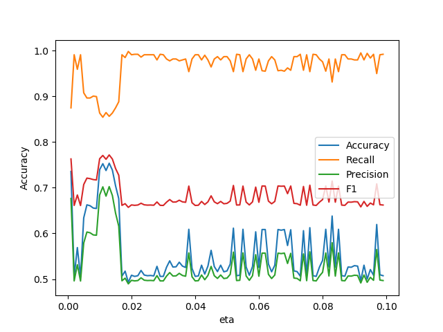
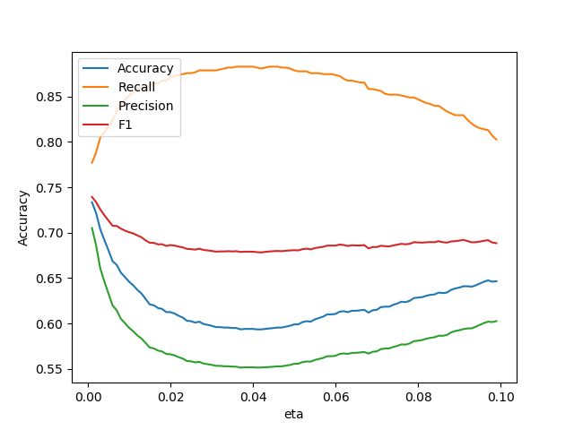
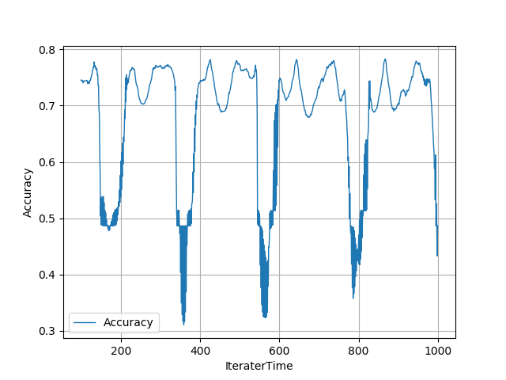
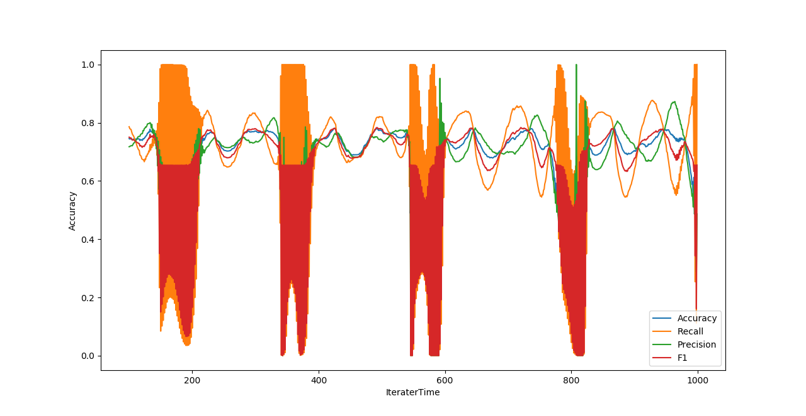
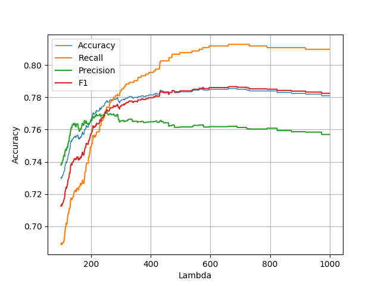

# 中山大学数据科学与计算机学院

# 移动信息工程专业-人工智能

# 本科生实验报告

（2017-2018 学年秋季学期）

课程名称：**Artificial Intelligence**

## 一、实验题目

Logistic Regression Model：利用logistics 回归模型进行二分类

## 二、实验内容

### 1.算法原理

Logistic Regression Model是一个分类模型，是研究二分类问题和一些影响因素之间关系的一种多变量分析方法，而且Logistic Regression分类模型是一个软分类模型。在分类情形下，该模型通过计算影响因素的权重，根据权重来了解预测目标的可能性。对于一个待分类样本$\vec{X}=\{x_1,x_2,..,x_n\}$，利用Logistic Regression分类模型求得的$\vec{W}=\{w_0,w_1,w_2,...,w_n\}$和待分类样本进行线性加权和得到$x=w_0+w_1x_1+w_2x_2+...+w_nx_n$，然后利用sigmoid函数
$$
f(x)=\frac{1}{1+e^{-x}}\tag{1}
$$
将$x$映射到$(0,1)$，最后根据$f(x)$的值来对待分类样本进行分类。

针对Logistic Regression分类模型求$\vec{W}=\{w_0,w_1,w_2,...,w_n\}$ 的问题，首先定义目标函数如下：
$$
f(x)=P(label|x)\in[0,1]\tag{2}
$$
即对某个特征向量$\vec{x}$，它属于$label$的概率为多少。

假设有$m$个样本，标签分别为$y_1,y_2,...,y_n$，设$p_i=P(y_i=1|x_i)$为给定条件下得到$y_i=1$的概率，同样，可以得到$P(y_i=1|x_i)=1-p_i$，所以能够准确预测该样本的概率为
$$
P(y_i)=p_i^{y_i}(1-p_i)^{1-y_i}\tag{3}
$$
由于样本之间相互独立，根据贝叶斯法则，可以得到似然函数为：
$$
\begin{split}
likelihood(logistic\quad h)\quad L(\vec{w})&\propto \prod_{i=1}^{m}P(y_n|x_n,\vec{w}) \\&= \prod_{i=1}^{m}(h(x_i))^{y_i}(1-h(x_i))^{1-y_i}
\end{split}
\tag{4}
$$
其中$h(x)$是利用logistics函数构造的新的模型：
$$
h(x)=\frac{1}{1+e^{-\vec{W}^Tx}}\tag{5}
$$
该模型主要用来对样本各个属性加权和进行概率评估。

我们的目标就是求出使得这一个似然函数的值最大的参数估计：
$$
{max}_\vec{w}\quad L(\vec{W})
$$
对上述公式进行变换，等价于如下最小化问题：
$$
{min_\vec{w}} \quad-logL(\vec{W})
$$
然后我们重写公式(1)，得到：
$$
\begin{split}
{min}_\vec{W}\quad Err(\vec{W}) & =-log \prod_{i=1}^{m}h(x_n)^{y_n}(1-h(x_n))^{1-y_n}
\\& = -\sum_{n=1}^m y_nlog(h(x_n))+(1-y_n)log(1-h(x_n))
\\&=-\sum_{i=1}^{m}y_ilog\frac{p_i}{1-p_i}+log(1-p_i)
\\&=-\sum_{i=1}^{m}y_i\vec{W}^T\vec{x_1}-log(1+e^{\vec{W}^T\vec{x_1}})
\end{split}
\tag{6}
$$
这就是目标函数的最小代价函数，也称为误差函数，在统计学上叫做交叉熵。而且，该函数是一个连续可导，并且二阶可微的凸函数。根据凸优化理论，存在一个全局最优解，使得$\nabla Err(\vec{w}) = 0$。所以，对公式(5)进行求导可得：
$$
\begin{split}
\frac{\partial L(\vec{W})}{\partial \vec{W}} & =-\sum_{i=1}^{m} (y_i-\frac{e^{\vec{W}^T\vec{x}}}{1+e^{\vec{W}^T\vec{x}}})\vec{x_i}
\\&=\sum_{i=1}^{m} (\frac{e^{\vec{W}^T\vec{x}}}{1+e^{\vec{W}^T\vec{x}}} -y_i )\vec{x_i}
\end{split}
\tag{7}
$$
上式就是误差函数的梯度公式。由于我们需要使得似然函数最大，也就是误差函数最小，所以我们需要求解误差函数的零点。通过求出误差函数的梯度，可以利用梯度下降法来求解函数的零点。

所以，根据梯度下降法，我们可以将权重$\vec{W}$的公式进行更新：
$$
\vec{W_{t+1}}=\vec{W_t}-\eta \nabla Err(\vec{W_t})\tag{8},\quad \eta为迭代梯度下降的步长
$$
$\eta$是自行设定的参数，它是算法迭代是对函数进行更新的步长。由数值计算的知识可以直到，步长越小，得到的最优解可能性越大，但是算法迭代所需的次数也越多。

最后，我们得到了一个最优解$\vec{W}$，利用这个最优解，便可以利用公式(1)对样本进行预测。

在计算过程中，sigmoid函数被用来将输出空间$[-\infty, +\infty]$映射到$[0,1]$区间上，将输出空间变成标签的估计概率。

### 2.伪代码

####梯度下降法计算$\vec{W}$

$$
\begin{split}
&input：迭代次数generation、训练数据X=\{\overrightarrow{x_1},\overrightarrow{x_2},...,\overrightarrow{x_n}\}
\\&output: \overrightarrow{W} 
\\&begin:
\\&\quad\quad initial\quad \vec{W_0}
\\&\quad\quad I_j=\sum_i w_{ij}O_i+\theta_j 

\\&\quad\quad\quad\quad		Err(\vec{W})=-\sum_{i=1}^{m}y_i\vec{W}^T\vec{x_1}-log(1+e^{\vec{W}^T\vec{x_1}})
\\&\quad\quad\quad\quad		\vec{W}=\vec{W}-\eta \nabla Err(\vec{W})
\\&end
\end{split}
$$

#### 预测

$$
\begin{split}
&input：\vec{W}、待预测数据X=\{\overrightarrow{x_1},\overrightarrow{x_2},...,\overrightarrow{x_n}\}
\\&output: 预测标签\vec{Y}=\{\vec{y_1},...,\vec{y_n}\}
\\&begin:
\\&\quad\quad \vec{P}=\vec{X}.*\vec{W}
\\&\quad\quad for \quad i \quad to \quad n
\\&\quad\quad\quad\quad if\quad sigmoid(\vec{p_i})>0.5
\\&\quad\quad\quad\quad\quad\quad	\vec{y_i}=1
\\&\quad\quad\quad\quad else
\\&\quad\quad\quad\quad\quad\quad	\vec{y_i}=0
\\&\quad\quad return\quad \vec{Y}
\\&end
\end{split}
$$

### 3.关键代码（带注释）

#### 批梯度更新$\vec{W}$

~~~python
def LR(eta, trainDataSet, trainLabelSet, IteraterTime) :
    w = ones(trainDataSet.shape[1])#这里列数为维度数，行数为样本数
    for i in range(IteraterTime) :
        wt = dot(trainDataSet,w)#更新参数考虑所有样本
        err = dot((sigmoid(wt) - trainLabelSet), trainDataSet)
        if len(err.nonzero()) == 0 :#判断误差是否为0
            break
        else :
            w = w - eta * err
    return w
~~~

#### 随机梯度更新$\vec{W}$

~~~python
def LRSingle(eta, trainDataSet, trainLabelSet, IteraterTime) :
    w = ones(trainDataSet.shape[1])              #这里列数为维度数，行数为样本数
    for i in range(IteraterTime) :
        for j in range(trainDataSet.shape[0]) :
            wt = trainDataSet[j] * w	#每次更新参数考虑单个样本
            err = (sigmoid(wt) - trainLabelSet[j]) * trainDataSet[j]
            if len(err.nonzero()) == 0 :
                break
            else :
                w = w - eta * err
    return w
~~~

### 4.创新点&优化

#### 向量化运算

由于本次实验使用Python语言进行，所以为了提高程序运行速度以及简化代码，对程序中的科学运算使用使用矩阵或者向量运算。

**部分代码：** 

~~~python
def LR(eta, trainDataSet, trainLabelSet, IteraterTime) :
    w = ones(trainDataSet.shape[1])              #这里列数为维度数，行数为样本数
    for i in range(IteraterTime) :
        wt = dot(trainDataSet,w)
        err = dot((sigmoid(wt) - trainLabelSet), trainDataSet)
        if len(err.nonzero()) == 0 :
            break
        else :
            w = w - eta * err
    return w
~~~

#### 随机梯度更新$\vec{W}$

由于批梯度下降每跟新一个参数的时候，要用到所有的样本数，所以训练速度会随着样本数量的增加而变得非常缓慢。为了让$\vec{W}$更好地拟合训练数据，提高收敛速度，利用单样本对$\vec{W}$进行更新，即利用一个训练样本来计算$Err(\vec{W})$，然后立即对$\vec{W}$进行更新。 

**关键代码：**

~~~python
def LRSingle(eta, trainDataSet, trainLabelSet, IteraterTime) :
    w = ones(trainDataSet.shape[1])              #这里列数为维度数，行数为样本数
    for i in range(IteraterTime) :
        for j in range(trainDataSet.shape[0]) :
            wt = trainDataSet[j] * w
            err = (sigmoid(wt) - trainLabelSet[j]) * trainDataSet[j]
            if len(err.nonzero()) == 0 :
                break
            else :
                w = w - eta * err
    return w
~~~

#### 基于PID动态调整$\vec{W}$

由于在梯度下降法当中，如果误差函数越小，迭代的步长应该越小，避免$\vec{W}$在最优解附近震荡。所以，引入PID算法来对$\vec{W}$的更新幅度进行控制，使得$\vec{W}$收敛到最优解。其中$kp,ki,kd$参数通过调参得出的较优参数。

**伪代码：**
$$
\begin{split}
&input： \overrightarrow{W} 、Err( \overrightarrow{W} )、lastError、 accumulateError、deltaT
\\&output: \overrightarrow{W} 
\\&begin:
\\&\quad\quad	errorDifferential = (Err( \overrightarrow{W} ) - lastError) / deltaT
\\&\quad\quad	lastError = Err( \overrightarrow{W} )
\\&\quad\quad	accumulateError = accumulateError + err
\\&\quad\quad	kp = 0.5
\\&\quad\quad	ki = 3
\\&\quad\quad	kd = 0.012
\\&\quad\quad	\overrightarrow{W} =\overrightarrow{W}  - (kp * err + ki * accumulateError + kd * errorDifferential)
\\&end
\end{split}
$$
这里展示的伪代码为单次迭代更新$\vec{W}$的PID算法，每次传参$lastError,accumulateError$并且更新。因为Python里面没有static关键字，所以通过传参实现保留上一次的值。

**关键代码：**

~~~python
def pidDynamic(w, err, lastError, accumulateError) :
    errorDifferential = (err - lastError) / 0.0001
    lastError = err
    accumulateError = accumulateError + err
    kp = 0.5
    ki = 3
    kd = 0.012
    return w - (kp * err + ki * accumulateError + kd * errorDifferential), lastError, accumulateError
~~~

#### 正则化

由于logistics回归模型可能存在过拟合的问题，所以引入正则化来降低模型的过拟合程度。正则化是结构风险最小化策略的实现，是在经验风险上加一个正则化项(regularizer)或惩罚项(penalty term)。正则化项一般是模型复杂度的单调递增函数，模型越复杂，正则化项就越大。

正则化的作用是选择经验风险最小和模型复杂度同时较小的模型；从贝叶斯估计的角度来看，正则化项对应于模型的先验概率；正则化通过保留所有的特征，但是减小某些特征的权重来消除模型的过拟合，具体实现是在原有的代价函数上加上惩罚项，所以，重写公式(6)：

$$
L(\vec{W})=[-\frac{1}{m}\sum_{i=1}^{m}y_ilogh(x_i)+(1-y_i)log(1-h(x_i))]+\frac{\lambda}{m} \sum_{j=1}^nw_j^2
\tag{9}
$$

在公式(6)的基础上，公式(9)不仅增加了惩罚项，而且将误差函数除以训练集样本数量，意义在于需要消除的误差值是每一个样本的平均误差值，避免训练数据过大导致误差过大使得$\vec{W}$在最优解附近振荡。

对惩罚项进行求导，可得：
$$
\frac{\partial \frac{\lambda}{m} \sum_{j=1}^mw_j^2}{\partial \vec{w}}=\frac{2\lambda}{m} \sum_{j=1}^mw_j
\tag{10}
$$
所以，重写公式(7)，得到：
$$
\nabla Err(\vec{w}) =\frac{1}{m} \sum_{i=1}^{m} (\frac{e^{\vec{W}^T\vec{x}}}{1+e^{\vec{W}^T\vec{x}}} -y_i )\vec{x_i}+\frac{2\lambda}{m}\sum_{j=1}^nw_j
\tag{11}
$$
得到新的梯度公式。

**关键代码：**

~~~python
def regularLR(eta, trainDataSet, trainLabelSet, IteraterTime, Lambda) :
    w = ones(trainDataSet.shape[1])              #这里列数为维度数，行数为样本数
    for i in range(IteraterTime) :
        wt = dot(trainDataSet,w)
        err = dot((sigmoid(wt) - trainLabelSet), trainDataSet)
        err = err / trainDataSet.shape[0] + Lambda * sum(w) / trainDataSet.shape[0]
        # if sqrt(dot(err,err)) < 0.00001 :
        #     break
        # else :
        w = w - eta * err
    return w
~~~

## 三、实验结果及分析
### 1.实验结果展示示例

**小数据集：**

|  3   |  4   | 1(label) |
| :--: | :--: | :------: |
|  3   |  5   | 1(label) |
|  1   |  1   | 0(label) |
|  -3  |  -1  | 0(label) |

**程序以0.1为步长单次更新$\vec{W}$结果：**
$$
\vec{W}=(0.90004587,  0.91910797,  0.90968101)
$$
**验算：**
$$
\begin{split}
\vec{S}&=
\left(
\begin{matrix}
1&3&4\\
1&3&5\\
1&1&1\\
1&-3&-1\\
\end{matrix}
\right)
\left(
\begin{matrix}
1\\
1\\
1\\
\end{matrix}
\right)=
\left(
\begin{matrix}
8\\
9\\
3\\
-3\\
\end{matrix}
\right)\\
\\
Err(\vec{W})&=
\left(
\begin{matrix}
(\frac{1}{1+e^8}-1)\times 1+(\frac{1}{1+e^9}-1)\times 1+(\frac{1}{1+e^3}-0)\times 1 +(\frac{1}{1+e^{-3}}-0)\times 1\\
(\frac{1}{1+e^8}-1)\times 3+(\frac{1}{1+e^9}-1)\times 3+(\frac{1}{1+e^3}-0)\times 1 +(\frac{1}{1+e^{-3}}-0)\times (-3)\\
(\frac{1}{1+e^8}-1)\times 4+(\frac{1}{1+e^9}-1)\times 5+(\frac{1}{1+e^3}-0)\times 1 +(\frac{1}{1+e^{-3}}-0)\times (-1)\\
\end{matrix}
\right)\\&=
\left(
\begin{matrix}
0.99954126\\
0.80892027\\
0.90318988\\
\end{matrix}
\right)\\
\\
\vec{W}&=
\left(
\begin{matrix}
1\\
1\\
1\\
\end{matrix}
\right)-0.1 \times
\left(
\begin{matrix}
0.99954126\\
0.80892027\\
0.90318988\\
\end{matrix}
\right)=
\left(
\begin{matrix}
0.90004587\\
0.91910797\\
0.90968101\\
\end{matrix}
\right)
\end{split}
$$
验算结果和程序运行结果一致。

### 2.评测指标展示及分析

**验证集划分：在给定数据集的基础上，乱序之后按照训练集：验证集=3：1的比例进行划分。**

####学习率$\eta$对模型准确性的影响

**迭代次数：200** 

如果单纯从验证准确率来看，在算法迭代200次的前提下，并不是学习率越小越好。从上图可以看出，实验模型最优的学习率$\eta$ 大概为0.16左右，从整体的趋势来看，学习率$\eta$越小，更加有利于梯度下降法收敛到最优解，当学习率$\eta$比较大的时候，会导致$\vec{W}$在函数最优解附近振荡。

#### 随机梯度下降对模型准确性的影响

**迭代次数：200** 

从图上可以看到，随机梯度下降方法会使得求出的解在最优解附近，求解$\vec{W}$受学习率$\eta$影响较小。由于这种更新方法随机性比较强，所以难以确定算法求出的解是否是全局最优解。

#### 基于PID动态调整$\vec{W}$模型预测能力

由于PID是动态学习渐进式逼近目标值的算法，所以，在一定的迭代区间内，求出的每一个$\vec{W}$的差别并不会很大，从准确率的图也可以看出来，模型验证的准确率基本保持在70%以上，说明基于PID的logistics回归模型具有较强的鲁棒性。但是，该算法存在周期性的振荡问题，振荡周期大概为200。经过分析，因为PID算法当中使用了误差积分，推算大概振荡原因是误差积累导致的误差积分过大，求出的解偏离最优解。如果要解决该问题，应该需要重新调参，将误差积分比例$ki$调低一下，误差步长$kp$调高一些。

#### 运用正则化减轻过拟合程度

利用了正则化，模型的预测准确性大幅度地提高了，并且对每个训练样本的误差进行了平均化，所以一定程度上减轻了过拟合程度，加上使用了惩罚项，所以在惩罚力度适当的情况下，模型具有很好的性能。但是，从准确率的趋势来看，如果惩罚力度过大，特征之间的差异性被弱化了，反而会使模型的准确性下降。

## 四、思考题

#### 如果把梯度为0，作为算法停止的条件，可能存在怎样的弊端？

* 考虑函数可能存在多个极小值点，如果把梯度为零作为迭代停止条件，所以可能会导致算法陷入局部最优，而得不到全局最优解。如下图，如果将梯度为零作为迭代停止条件，很可能算法在计算到$w'$便停止计算，但$w'$并不是全局最优解。

  

* 在实际上，$\vec{W}$会在函数最优解附近震荡，如果将梯度为零作为停止条件，可能导致算法运行时间过长甚至死循环。

#### 𝜂 的大小会怎么影响梯度下降的结果？给出具体的解释，可视化的解释最好，比如图形展示等

* $\eta$过小：会导致收敛的速度比较慢，如下图坐部分

* $\eta$过大：会出现震荡的现象，即跳过最优解，在最优解附近徘徊，如下图右部分

  

#### 批梯度下降和随机梯度下降的优缺点

* 优点：
  * 批梯度：收敛和梯度下降更加平稳，容易收敛到全局最优解
  * 随机梯度：迭代和收敛速度快
* 缺点：
  * 批梯度：下降和收敛的速度慢，当数据样本非常多的时候，算法运行十分耗时，
  * 随机梯度：噪音较多，使得每次都不一定向着整体最优化方向，迭代容易陷入到局部最优解中

